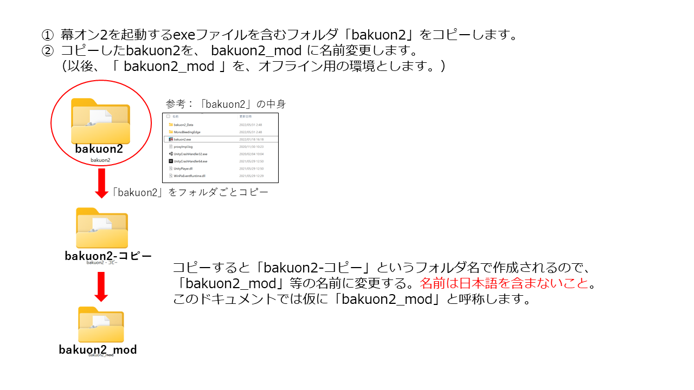
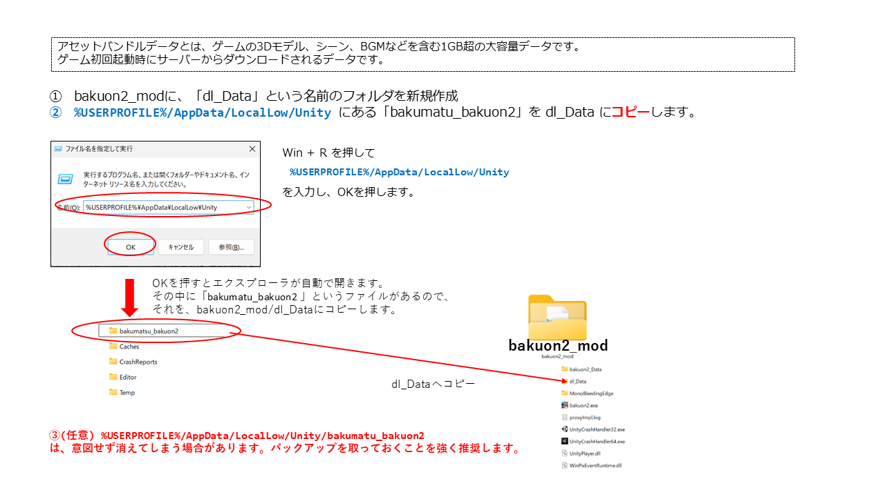
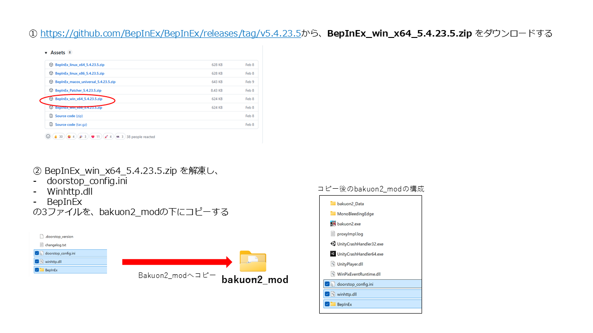
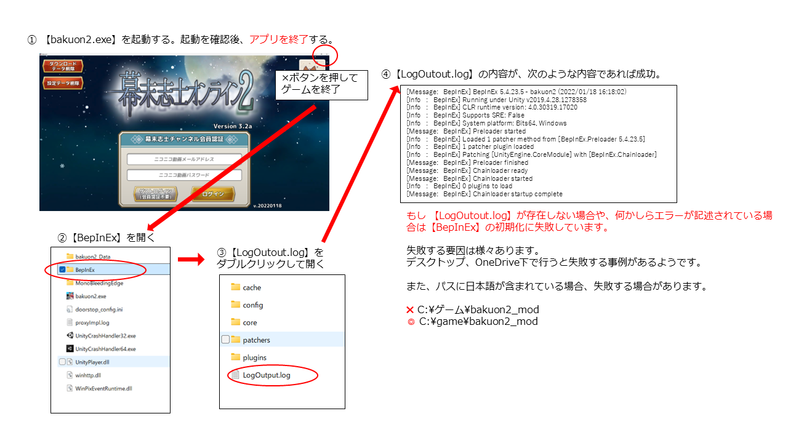
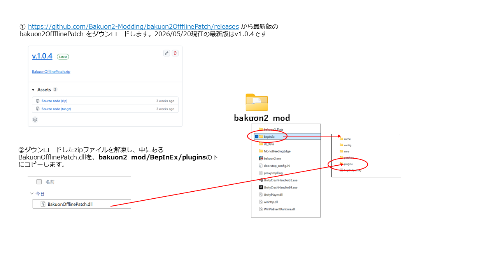
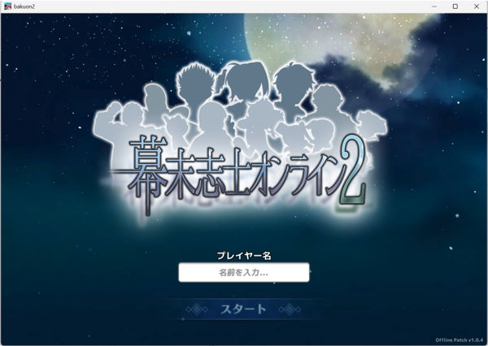

# 幕末志士オンライン2　オフライン化パッチ導入手順書

- 本書は、サ終したオンラインゲーム「幕末志士オンライン2」（以下、幕オン2。）をオフライン状態で起動するための環境構築の手順書です。

- オフラインパッチはWindows版のみ対応しています。

- オフラインパッチを適用すると、ニコニコ動画の認証やサーバー通信系の処理を全て無効化し、オフライン状態でゲームを起動できます。ダンジョンやアトラクションなど、全てのゲームモードをプレイできます。（ただし、動画再生の絵馬は使用できません）

- 【注意】オフライン化は自己責任で行ってください。


## 動作環境

- Windows 10 / 11
- 「幕末志士オンライン2」がインストール済みであること
    - バージョン： Ver.3.2a(v.20220118)

## 1. 幕オン2のゲームデータをコピーする
1. 幕オン2を起動するexeファイルを含むフォルダ「bakuon2」をコピーします。
2. コピーしたbakuon2を、`bakuon2_mod` に名前変更します。（以後、`bakuon2_mod`を、オフライン用の環境とします。）




## 2. アセットバンドルデータをコピー

アセットバンドルデータとは、ゲームの3Dモデル、シーン、音声などを含む1GB超の大容量データです。ゲーム起動時にサーバーからダウンロードされ、ローカルに保存される仕組みでした。

> **最重要**: このデータは必ずバックアップしてください。

**サービスが終了した現在、このデータを再取得する方法はありません。** このデータがないとゲームの3Dモデルやシーンが表示されません。もしゲームのトップ画面にあった「ダウンロードデータ削除」ボタンを押してしまっていた場合、残念ながらデータは喪失しており、復旧は困難です。


1. bakuon2_modに、「dl_Data」という名前のフォルダを新規作成
2. `%USERPROFILE%/AppData/LocalLow/Unity` にある「bakumatu_bakuon2」を dl_Data にコピーします。
    
        補足:

        Win + R を押して
        %USERPROFILE%/AppData/LocalLow/Unity
        を入力し、OKを押します。（↑をコピペしてください）

    
3. `%USERPROFILE%/AppData/LocalLow/Unity/bakumatu_bakuon2`
は、意図せず消えてしまう場合があります。バックアップを取っておくことを強く推奨します。



## 3. UnityのMODを有効にするツール【BepInEx】をインストール
1. [githubのBepInExのページ](https://github.com/BepInEx/BepInEx/releases/tag/v5.4.23.5)から、`BepInEx_win_x64_5.4.23.5.zip`をダウンロードする

2. `BepInEx_win_x64_5.4.23.5.zip` を解凍し、以下の3ファイルをbakuon2_modの下にコピーする
        - doorstop_config.ini
        - Winhttp.dll
        - BepInEx



## 4.【BepInEx】を初期化する。（一度、幕オン2を起動し、終了する）

1. 【bakuon2.exe】を起動する。起動を確認後、アプリを終了する。
2. 【BepInEx】を開く
3. 【LogOutout.log】をダブルクリックして開く
4. 【LogOutout.log】の内容が、次のような内容であれば成功。

    ```
    [Message:   BepInEx] BepInEx 5.4.23.5 - bakuon2 (2022/01/18 16:18:02)
    [Info   :   BepInEx] Running under Unity v2019.4.28.1278358
    [Info   :   BepInEx] CLR runtime version: 4.0.30319.17020
    [Info   :   BepInEx] Supports SRE: False
    [Info   :   BepInEx] System platform: Bits64, Windows
    [Message:   BepInEx] Preloader started
    [Info   :   BepInEx] Loaded 1 patcher method from [BepInEx.Preloader 5.4.23.5]
    [Info   :   BepInEx] 1 patcher plugin loaded
    [Info   :   BepInEx] Patching [UnityEngine.CoreModule] with [BepInEx.Chainloader]
    [Message:   BepInEx] Preloader finished
    [Message:   BepInEx] Chainloader ready
    [Message:   BepInEx] Chainloader started
    [Info   :   BepInEx] 0 plugins to load
    [Message:   BepInEx] Chainloader startup complete
    ```

もし 【LogOutout.log】が存在しない場合や、何かしらエラーが記述されている場合は【BepInEx】の初期化に失敗しています。

失敗する要因は様々あります。
デスクトップ、OneDrive下で行うと失敗する事例があるようです。
また、パスに日本語が含まれている場合、失敗する場合があります。
- ✖ C:\ゲーム\bakuon2_mod
- ◎ C:\game\bakuon2_mod




## 5. 幕オン2のオフライン化パッチをインストールする

1. [パッチ配布ページ](https://github.com/Bakuon2-Modding/bakuon2OffflinePatch/releases) から最新版の bakuon2OffflinePatch をダウンロードします。2026/06/22現在の最新版はv1.0.6です

2. ダウンロードしたzipファイルを解凍し、中にあるBakuonOfflinePatch.dllを、bakuon2_mod/BepInEx/pluginsの下にコピーします。

- インストール完了後のファイル構成。（一部省略）
    ```
    bakuon2_modded/
    ├── bakuon2.exe
    ├── BepInEx/
    │   ├── core/
    │   ├── plugins/
    │   │   └── BakuonOfflinePatch.dll ← オフライン化パッチ
    │   └── config/
    └── dl_Data/
        └── bakumatsu_bakuon2/   ← アセットバンドル
            ├── scene/
            ├── city/
            ├── suteage/
            ├── accessory/
            ├── animation/
            ├── audio/
            ├── roomeditor/
            └── sprite/
    ```



## 6. 幕オン2を起動

bakuon2.exeを実行したとき、次のような画面になればオフライン化が成功しています。
名前を入力し、スタートをクリックしてください。



## 免責事項
- オフラインパッチは、サービス終了済みの幕末志士オンライン2をアーカイブ目的でプレイ可能な状態に保つことを目的とした、非公式の非営利の保存プロジェクトです。
- オフラインパッチは元のパブリッシャーおよびその関連会社とは一切関係がなく、また承認・公認されたものでもありません。
- 元のゲームおよび関連フランチャイズに関するすべての商標、著作権、知的財産権は、それぞれの権利者に帰属します。
- オフラインパッチに含まれるすべてのコードは、サービス終了済みのゲームクライアントをオフライン環境で動作させるために、クリーンルーム方式のリバースエンジニアリングによって開発されたオリジナルのものです。
- オフラインパッチには、著作権で保護されたゲームアセット、バイナリ、またはマスターデータは一切含まれていません。
- オフラインパッチの使用は自己責任で行ってください。作者は、オフラインパッチの使用により発生するいかなる損害について責任を負いません。